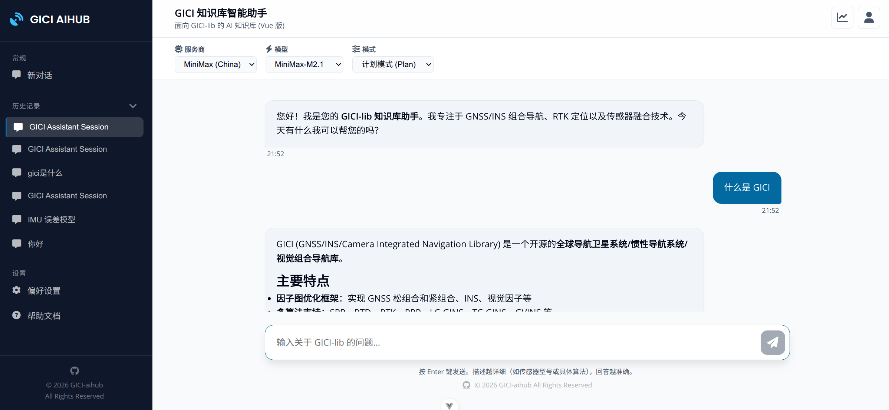

# aihub-web-vue

GICI 助手 - GNSS/INS 组合导航专家 (Vue 3 + Vite)

面向 GICI-lib 的 AI 知识库

前端基于 Vue3.js+Vite 实现，后端基于 OpenCode 实现



## 部署指南

### 1. 环境准备

- **Node.js**: 建议使用 v20.19.0 或 v22.12.0 及以上版本。
- **Python**: 建议使用 v3.13 或以上版本 (用于后端服务)。
- **包管理器**: 前端推荐使用 `npm` (v10+)，后端推荐使用 `uv`。

### 2. 前端部署 (aihub-web-vue)

#### 配置环境变量
在 `frontend/` 目录下创建 `.env.local` 文件，配置后端服务的访问地址：

| 变量名 | 说明 | 默认值 | 关联后端 |
| :--- | :--- | :--- | :--- |
| `VITE_PORT` | 开发服务器端口 | `5173` | - |
| `VITE_API_BASE_URL` | OpenCode 服务器地址 | `http://127.0.0.1:5000` | 主后端 (AI 业务) |
| `VITE_AUTH_API_URL` | 用户管理后端地址 | `http://127.0.0.1:8000` | 第二后端 (认证) |

示例 `frontend/.env.local`:
```env
VITE_PORT=5173
VITE_API_BASE_URL=http://localhost:5000
VITE_AUTH_API_URL=http://localhost:8000
```

#### 安装与运行
```sh
cd frontend

# 安装依赖
npm install

# 本地开发 (带热更新)
npm run dev

# 生产构建
npm run build
```

### 3. OpenCode 部署 (核心 AI 引擎)

OpenCode 服务器负责处理核心 AI 业务逻辑及知识库问答。

```bash
# 确保已安装 opencode 工具
opencode serve --host 127.0.0.1 --port 5000
```
- **配置**: 确保前端 `VITE_API_BASE_URL` 指向此服务的地址。
- **功能**: 提供 `/api` 路径下的 AI 能力支持。

### 4. 后端部署 (用户管理/第二后端)

负责用户注册、登录及权限管理。用户信息持久化在 `backend/users.json`。

#### 服务配置
在 `backend/` 目录下创建 `.env` 文件：
```env
# ./backend/.env
HOST=127.0.0.1
PORT=8000
DEBUG=True
```

#### 安装与启动
推荐使用 [uv](https://github.com/astral-sh/uv) 快速启动：
```bash
cd backend
# 使用 uv 直接运行 (会自动创建虚拟环境并安装依赖)
uv run main.py
```
或者使用传统方式：
```bash
cd backend
python -m venv .venv
source .venv/bin/activate  # Windows 使用 .venv\Scripts\activate
pip install -r pyproject.toml
python main.py
```

---

## 技术架构
- **前端框架**: Vue 3 (Composition API)
- **构建工具**: Vite
- **图标库**: Font Awesome 6 (本地化部署)
- **字体**: 本地化部署 (Open Sans & Poppins)

## 项目结构
- `src/components`: UI 组件
- `public/fonts`: 本地化字体资源
- `public/fontawesome`: 本地化 Font Awesome 资源
- `index.html`: 入口 HTML

## 离线支持
本项目所有静态资源（字体、图标等）均已本地化，支持在无外网环境下部署和使用。
